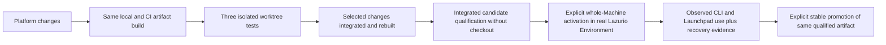

# Build, qualification and activation lifecycle

Status: the two test paths and deliberate whole-Machine candidate activation are
accepted outcomes. Mechanisms and command spellings below are proposals, not
implemented commands or a mandate to switch the current host.

Use one product version for CLI, server/Launchpad runtime and generator. Their
compatibility is tested as one delivered product. Profile/preferences schemas retain
their separate contract versions; they are not independently drifting binaries.

```text
reviewed PR + CI → main → immutable candidate artifacts → native acceptance
                      → opt-in preview → approved stable promotion
```

A merge does not roll out software. Candidate acceptance includes install, product
upgrade, profile preservation and recovery on each supported native platform. Preview
is opt-in. Stable requires an explicit authorized decision for the exact candidate.
Promote the same tested artifacts and digests; do not rebuild them at promotion.

Artifact identity is immutable (`version + target + digest + source provenance`).
Preview/stable are authenticated channel references selecting an existing artifact.
Publish monotonic channel metadata and retain signed historical metadata for restore;
the implementation must prevent a stale/malicious channel response from triggering
an unintended downgrade. An explicit rollback selects a known compatible retained
version and is distinguishable from normal channel progression.

If npm becomes a supported transport, settle version semantics before shipping:
`1.0.0-rc.1` and `1.0.0` are different package identities and cannot be renamed while
claiming identical package bytes. Either promote one already final-version immutable
package via distribution tags after preview qualification, or treat the final package
as a new artifact requiring qualification. The standalone recommendation avoids
making an unproven npm promotion promise; it does not forbid a future thin shim.

First-version update behavior should detect availability and explain compatibility;
activation remains explicit. Detection is not a download/execute mandate. Resident
updates require a bounded drain and safe resumption through the actual lifecycle
owner. Offline, failed signature, unsupported schema or unknown state preserves the
current installation and reports a precise reason.

Product update, profile activation and Source→Managed migration are distinct
operations. Rollback is permitted only with the compatibility and preservation
evidence in [migration and recovery](migration-and-recovery.md). Channel rollback
alone cannot reverse data/schema changes.

Before implementing the release publisher, accept: version/transport identity,
signing/trust bootstrap and rotation, channel authorization, artifact retention,
OS signing/notarization requirements, native support floor, update-check privacy,
and preview cohort exit criteria. Prefer the provider's standard release and signing
capabilities; do not create a general deployment service for this workflow.

## Distribution decision inputs (slice 1a)

These are researched options, not an accepted bootstrap protocol or authorization
to provision signing identities. The first consumer is the terminal install on a
fresh machine without Bun, Node, npm or a source checkout.

| Option | Useful property | Gap for the first-install contract |
| --- | --- | --- |
| HTTPS download and checksum only | Small provider-native baseline | A co-delivered checksum does not authenticate a publisher independently of the transport; does not meet the accepted signature requirement |
| GitHub immutable release assets and attestations | Existing provider binds assets to a release/ref and prevents changing published assets | Ordinary verification uses an additional verifier; release immutability does not authenticate the first verifier or authorize preview/stable selection |
| OS-signed distribution plus authenticated update metadata | OS trust can validate platform packages; metadata can govern future selection | Linux/bootstrap verification, key custody/rotation, expiry and offline behavior still need a concrete cross-platform contract |

Proposed transport: prefer GitHub immutable release assets over a new download
service. GitHub permits assembling all assets in a draft before publication locks
them; this fits signing and qualification before promotion. Release notes and
pre-release/latest flags remain editable, so those flags alone are not trusted
channel authorization. Do not enable repository settings or publish a candidate
merely because this option is documented. See [immutable releases](https://docs.github.com/en/code-security/concepts/supply-chain-security/immutable-releases)
and [release verification](https://docs.github.com/en/code-security/how-tos/secure-your-supply-chain/secure-your-dependencies/verify-release-integrity).

For metadata verification, evaluate an established update-security implementation
such as [TUF](https://theupdateframework.io/docs/overview/) before implementing
custom rotation, expiry and rollback protection. TUF's trusted initial metadata
must itself be delivered authentically; adding it does not solve first-install
trust automatically. No TUF dependency or new updater is selected here.

Keep native distribution signatures separate from build provenance:
[Apple Developer ID and notarization](https://developer.apple.com/developer-id/)
are the macOS route to qualify. A Windows public-trust signing provider such as
[Microsoft Artifact Signing](https://learn.microsoft.com/en-us/azure/artifact-signing/concept-trust-models)
requires eligibility and identity validation; it is an option, not an assumed
company account or a purchase instruction. GitHub build attestations provide
additional provenance, not a replacement for these platform-specific checks.

Before coding the installer, select the exact bootstrap trust anchor and verifier
delivery, supported OS prerequisites, artifact/container layout, channel metadata
policy and signing custody. Demonstrate a clean first install, substituted verifier,
tampered artifact, wrong publisher, expired/stale metadata and offline failure in
synthetic fixtures. Missing credentials can block official signing without blocking
unsigned local build tests; those tests must remain explicitly non-release evidence.

## Two independent test modes



**Worktree isolation:** three agents may run concurrently, each from its own Platform
worktree and exact artifact. Each gets an owned temporary Lazurio Folder and test Organization,
process-local PATH entry, server/allocated ports, state locator and evidence directory.
The test harness passes explicit paths; it must not fall back to the daily Lazurio Environment,
ambient credentials, normal user state or another test's server. Isolating a directory
alone is insufficient: redirect all product-owned OS state paths and inherit only
reviewed environment values. Fixtures contain no real Organization/Personalspace data.
Native acceptance uses a copied artifact with the checkout unavailable; rapid source
unit tests are allowed earlier. Cleanup verifies fixture/process ownership, preserves
private failure evidence and removes only that run's own resources.

**Integrated personal acceptance:** selected worktree changes are integrated at one
reviewed source ref and built through the same packaging path as CI. Run the combined
candidate tests before activation; no worktree build independently replaces daily
Lazurio. The Principal deliberately activates that exact candidate for the whole
single-Principal Machine: ordinary CLI launches and Launchpad use it with the selected
real Lazurio Environment and real Organizations. This is stronger than a temporary shell PATH override.
If the current Lazurio Folder needs migration, the migration rehearsal and separately authorized
apply must finish first. Design agreement here is not an instruction to act on a host.

## Smallest proposed local interface

Names are illustrative future interfaces, not commands available in this proof:

```text
lazurio-dev build --output <artifact-directory>
lazurio-dev test-artifact --artifact <artifact> --fixture <owned-temporary-directory>
lazurio product stage --artifact <integrated-artifact>
lazurio product activate --digest <reviewed-digest>
lazurio --root <chosen-root> launchpad
lazurio product activate --digest <retained-compatible-digest>
```

`lazurio-dev` denotes a development entrypoint in the same package, not a new service
or installer. Prefer adapting the existing build/installer/lifecycle seams over
creating a separate candidate channel manager. The official installer establishes
one stable entrypoint in the platform's supported PATH integration. That entrypoint
resolves one owner-controlled active version record; product versions live in immutable
versioned directories. Do not overwrite a running executable or rewrite PATH for each
candidate. Windows requires a native-tested launcher/activation method; symlinks and
POSIX rename semantics cannot be assumed. Source changes have no effect until build
and deliberate activation. Selecting a Lazurio Folder never selects a program, or vice versa.

## Activation state and failure contract

| Phase | Owner and evidence | Failure / recovery |
| --- | --- | --- |
| Build and stage | Build produces target/digest/ref manifest; installer verifies trust and compatibility before staging | Failed build/download/unpack leaves active version unchanged; invalid candidate never becomes selectable |
| Plan activation | Existing installer compares expected active revision and captures compatible prior version and generated-state revisions | Concurrent activation, unknown schema or drift stops before switch |
| Drain | Existing lifecycle owner blocks new affected writes, lists running operations and their pinned artifact/generation | Busy operation stops activation or finishes under an explicitly safe pin; no unrelated process kill |
| Select | One transaction changes active version for future launches; root stays independently selected | Interrupted switch recovers to a complete old/new record, never a mixed CLI/server installation |
| Restart and health | Owned Launchpad restarts on selected artifact; new sessions capture version/generation; existing sessions keep snapshot and require restart before affected work | Health failure restores prior compatible program selection only when safe; incompatible data requires forward repair |
| Observe | CLI and UI display artifact/version/Lazurio Folder; evidence includes cold launches and completion of real scoped tasks | Failed candidate halts promotion, preserves diagnostics privately and does not erase user work |

Record server/session artifact and generation at start. Existing sessions do not change
instructions midway through work; a stale client must reconnect/restart or receive an
explicit incompatibility error. Already running module processes may continue only if
the lifecycle owner proves their contracts remain compatible; otherwise drain them.
No transition silently adopts a process started under a different artifact. Activation
and migration share existing locks/state ownership rather than independent competing
writers. Rollback of a program never implies undoing schema changes or new repo writes;
retain those changes and use the recovery contract. Stable selects the same qualified
target artifacts, not a rebuild after personal acceptance.

## Required lifecycle evidence

For the current foundation proof, `bun run scripts/identify-proof.ts` rebuilds
the native proof from a clean committed checkout and emits its byte digest,
size, source commit, lockfile digest and pinned toolchain. This is an unsigned
build identity, not publisher authentication, a release manifest or a native
installation qualification. Run from the repository root using the pinned Bun.
The output must not be used as authorization to install or activate a product.

Run three simultaneous fixtures and prove distinct PATH resolution, Lazurio Folder, state and
processes; deliberately collide a port and terminate one run without harming its peers
or daily installation. Separately prove integrated Machine activation with cold CLI
and Launchpad starts, a busy writer, old session, build failure, interrupted switch,
health failure, incompatible downgrade and new data writes. Record exact native OS,
artifact and harness versions. Personal acceptance is not a substitute for the other
OS cells. Failure logs stay private until separately sanitized for public evidence.
