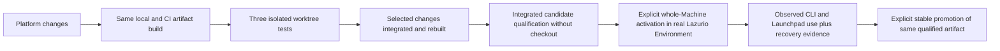

# Build, qualification and activation lifecycle

Status: the two test paths and deliberate whole-Machine candidate activation are
accepted outcomes. Mechanisms and command spellings below are proposals, not
implemented commands or a mandate to switch the current host.

Use one product version for CLI, server/Launchpad runtime and generator. Their
compatibility is tested as one delivered product. Profile/preferences schemas retain
their separate contract versions; they are not independently drifting binaries.

```text
reviewed PR + CI → main → immutable candidate artifacts → native acceptance
                      → opt-in preview → approved stable promotion
```

A merge does not roll out software. Candidate acceptance includes install, product
upgrade, profile preservation and recovery on each supported native platform. Preview
is opt-in. Stable requires an explicit authorized decision for the exact candidate.
Promote the same tested artifacts and digests; do not rebuild them at promotion.

Artifact identity is immutable (`version + target + digest + source provenance`).
Preview/stable are authenticated channel references selecting an existing artifact.
Publish monotonic channel metadata and retain signed historical metadata for restore;
the implementation must prevent a stale/malicious channel response from triggering
an unintended downgrade. An explicit rollback selects a known compatible retained
version and is distinguishable from normal channel progression.

If npm becomes a supported transport, settle version semantics before shipping:
`1.0.0-rc.1` and `1.0.0` are different package identities and cannot be renamed while
claiming identical package bytes. Either promote one already final-version immutable
package via distribution tags after preview qualification, or treat the final package
as a new artifact requiring qualification. The standalone recommendation avoids
making an unproven npm promotion promise; it does not forbid a future thin shim.

First-version update behavior should detect availability and explain compatibility;
activation remains explicit. Detection is not a download/execute mandate. Resident
updates require a bounded drain and safe resumption through the actual lifecycle
owner. Offline, failed signature, unsupported schema or unknown state preserves the
current installation and reports a precise reason.

Product update, profile activation and Source→Managed migration are distinct
operations. Rollback is permitted only with the compatibility and preservation
evidence in [migration and recovery](migration-and-recovery.md). Channel rollback
alone cannot reverse data/schema changes.

Before implementing the release publisher, accept: version/transport identity,
signing/trust bootstrap and rotation, channel authorization, artifact retention,
OS signing/notarization requirements, native support floor, update-check privacy,
and preview cohort exit criteria. Prefer the provider's standard release and signing
capabilities; do not create a general deployment service for this workflow.

## Distribution decision inputs (slice 1a)

The accepted trust boundary is HTTPS initial delivery from the official source,
then TUF verification. This does not protect a compromised first bootstrap merely
by embedding a root inside that same download. The Principal permits a controlled
internal pilot before Apple Developer ID/notarization and Windows publisher signing;
public release still requires them and tests of the final signed bytes. No OS protections
are disabled. Detailed hosting, key handling, expiry and layout choices are delegated
for implementation and verification; operational custody stays outside this public source.

The options below retain the design rationale, not a request to choose initial trust
again or authorization to provision signing identities. The first consumer is the terminal install on a
fresh machine without Bun, Node, npm or a source checkout.

| Option | Useful property | Gap for the first-install contract |
| --- | --- | --- |
| HTTPS download and checksum only | Small provider-native baseline | A co-delivered checksum does not authenticate a publisher independently of the transport; does not meet the accepted signature requirement |
| GitHub immutable release assets and attestations | Existing provider binds assets to a release/ref and prevents changing published assets | Ordinary verification uses an additional verifier; release immutability does not authenticate the first verifier or authorize preview/stable selection |
| OS-signed distribution plus authenticated update metadata | OS trust can validate platform packages; metadata can govern future selection | Linux/bootstrap verification, key custody/rotation, expiry and offline behavior still need a concrete cross-platform contract |

Proposed transport: prefer GitHub immutable release assets over a new download
service. GitHub permits assembling all assets in a draft before publication locks
them; this fits signing and qualification before promotion. Release notes and
pre-release/latest flags remain editable, so those flags alone are not trusted
channel authorization. Do not enable repository settings or publish a candidate
merely because this option is documented. See [immutable releases](https://docs.github.com/en/code-security/concepts/supply-chain-security/immutable-releases)
and [release verification](https://docs.github.com/en/code-security/how-tos/secure-your-supply-chain/secure-your-dependencies/verify-release-integrity).

For metadata verification, evaluate an established update-security implementation
for [TUF](https://theupdateframework.io/docs/overview/) before implementing
custom rotation, expiry and rollback protection. TUF's trusted initial metadata
must itself be delivered authentically; adding it does not solve first-install
trust automatically. TUF is selected as the verification approach; the concrete library
still needs qualification. No second updater is introduced.

Keep native distribution signatures separate from build provenance:
[Apple Developer ID and notarization](https://developer.apple.com/developer-id/)
are the macOS route to qualify. A Windows public-trust signing provider such as
[Microsoft Artifact Signing](https://learn.microsoft.com/en-us/azure/artifact-signing/concept-trust-models)
requires eligibility and identity validation; it is an option, not an assumed
company account or a purchase instruction. GitHub build attestations provide
additional provenance, not a replacement for these platform-specific checks.

Before coding the installer, select the exact bootstrap trust anchor and verifier
delivery, supported OS prerequisites, artifact/container layout, channel metadata
policy and signing custody. Demonstrate a clean first install, substituted verifier,
tampered artifact, wrong publisher, expired/stale metadata and offline failure in
synthetic fixtures. Missing credentials can block official signing without blocking
unsigned local build tests; those tests must remain explicitly non-release evidence.

## Two independent test modes

### Internal-pilot implementation contract

Development packaging is executable with the pinned Bun from a clean committed
repository root:

```sh
bun run scripts/build-candidate.ts /absolute/absent/output-directory
bun run scripts/smoke-candidate.ts /absolute/absent/output-directory/lazurio
```

The parent output directory must already exist and be canonical; the output itself
must be absent. The build installs frozen development dependencies without lifecycle
scripts, runs the narrow publication guard, compiles the real CLI and emits
`identity.json`. It refuses a dirty source or an existing output; partial failed
output is retained, not cleaned automatically. The identity describes unsigned bytes,
not a TUF target, release authorization or reproducibility proof.

The POSIX smoke accepts an existing executable, creates its own temporary Folder,
initializes Czech instructions, changes to English, starts that executable's Launchpad,
checks embedded HTML, API denial and authenticated profile state, then stops it.
The child's PATH excludes development runtimes. This is not a clean-OS install,
browser interaction, full module journey, Windows acceptance or TUF verification.
Compile this runner separately for a source-free VM if needed; it never rebuilds
the supplied candidate. A candidate's identity digest must be checked separately
against trusted metadata before any real installation.

The following choices specify the delegated implementation direction, not completed
qualification. Real hosting and signing custody must be verified before a real pilot;
local development uses disposable keys and an isolated metadata server.

- Build the real `src/cli.ts` entrypoint, including its Launchpad assets and Folder
  Factory. `proof/main.ts` remains a separate demonstration and is not a release input.
  Pin Bun from `packageManager`; disable compiled ambient dotenv/bunfig loading.
  The distribution does not bundle every module's Bun or database dependency.
- Use one standalone executable per qualified native target, with a separate build
  identity based on `scripts/artifact-identity.ts`: product version, full source SHA,
  lock digest, exact toolchain, target, byte length and SHA-256. This JSON is provenance,
  not authentication. A clean source tree and frozen dependencies are build prerequisites.
  A local build must use an explicit new output directory and never replace an installation.
- Deliver immutable artifacts through GitHub release assets. A static HTTPS metadata
  origin serves versioned TUF metadata, publishing timestamp last. Its concrete URL is
  release configuration, not inferred from `latest` or from an Organization manifest.
  Local fixtures use their own explicit loopback origin; never contact production by fallback.
- Start with an explicit `pilot` channel. A TUF-authenticated target document selects
  the product version and exact platform artifact identity. Reject unknown schema,
  unsupported targets, mismatched length/hash and downgrade selection before staging.
  A release flag alone cannot authorize a channel change. No automatic channel switch.
- Separate root, targets, snapshot and timestamp keys. Controlled-pilot root and targets
  each use their own owner-controlled offline key with threshold one; disclose the
  single-key compromise risk. Build jobs receive neither private key. Snapshot and
  timestamp have separate custody from build output. Production values never enter
  source, logs or fixtures; the private custody record names actual operators/storage.
  Before broader release, explicitly evaluate threshold custody and recovery ownership.
- Initial metadata lifetimes are root one year, targets 90 days, snapshot 30 days and
  timestamp seven days with daily refresh. These are policy choices, not TUF defaults.
  Expiry blocks a new install/update, not use of the already installed product. Clock
  anomalies must produce an actionable error, never disable expiry checking.
  Retain every intermediate root for sequential rotation and exercise old/new signatures.
- Install per user outside the Folder: macOS `~/Library/Application Support/Lazurio`,
  Linux `${XDG_DATA_HOME:-~/.local/share}/lazurio`, Windows `%LOCALAPPDATA%/Lazurio`.
  Resolve and validate actual absolute paths; this notation is not shell code to execute.
  Versioned product directories are immutable after verification. One stable entrypoint
  selects the active version through the existing installation owner. Windows entrypoint
  replacement and running-handle behavior must be qualified natively, not assumed from POSIX.
- Stage and activate are separate states under one installer lock. A downloaded target
  is not installed; a staged target is not active. Reject partial records and retain
  recovery evidence after interruption. Preserve the active and previous compatible
  version plus every version referenced by a live process or recovery record. For the
  controlled pilot, do not automatically prune published artifacts or unknown local state.
- Initial installation and update checks are explicit terminal actions, not network
  activity on every CLI launch. Offline failure preserves existing active software.
  No source checkout, user Bun/Node/npm, sudo, provider credential or access to a private
  integration repository is required merely to launch the installed CLI and Launchpad.

Qualification starts on the available native macOS ARM64 and Linux ARM64 fixtures.
Other target names in an identity schema do not establish support. Windows and the
remaining launch matrix remain required work, not silently dropped deliverables.
The full first installed consumer must use the real CLI/Launchpad module lifecycle,
not just `--help`. All earlier preservation, tamper, concurrency and recovery gates apply.

### TUF client integration boundary

The development pilot channel document uses `schemaVersion: 1`, `channel: "pilot"`,
a positive integer `sequence`, and `targets` mapping execution targets to
`artifacts/<sha256>/lazurio` (or `lazurio.exe` on Windows). `selectPilotTarget`
consumes JSON only after TUF verification; it rejects duplicate/unknown fields,
unsupported targets, path escapes, lower sequence and changed bytes at the same
sequence. Identical authenticated bytes are retryable. The installation owner must
persist the high-water mark without resetting it on network failure.

The shared `downloadPilotCandidate` operation now connects this parser to the
pinned TUF client and constrained transport. It requires explicit trusted bootstrap
bytes or an established checkpoint plus channel high-water mark, creates a new owned
output directory, verifies the channel and the digest-addressed target, bounds channel
size to 64 KiB and artifact size to the caller's policy, and syncs downloaded files.
Only top-level targets are supported. Existing output is refused and failures retain
their isolated evidence. Successful results include a new checkpoint and selection;
the original trusted state and downloaded candidate are not overwritten. The regular
test suite runs the signed fixture scenarios against this shared operation.

Before network consumption, the operation syncs a separate `input-trust.json` and
its directory entries; the client's mutable cache cannot replace this original input.
`MetadataJournalFetcher` records each metadata response with exclusive file creation
and file/directory sync before returning its bytes to TUF. Records are untrusted
received evidence, not accepted checkpoints: recovery must cryptographically verify
them from the retained input, never promote records just because they exist. Names
contain only an ordinal and the permitted metadata filename, not origin credentials
or query strings. Bounds are 1 MiB per response, 32 MiB total and 260 records; only
top-level metadata is supported. A record-write failure prevents further use of that
fetcher and preserves partial output. Tests cover occupied records, concurrent refusal,
retention after payload tampering and abrupt process exit after a returned record.
The exit test does not establish power-loss durability or completed replay recovery.

This is not yet a download/install command or the durable installation state owner.
In particular, accepted metadata/root progress during a failed operation must be
reconciled under that owner's lock before another refresh; it must not be discarded
by retrying from the older input checkpoint. No automatic retry/repair is provided.
Before staging, the
consumer must bind the selected path to TUF length/hash and product build identity,
check product-version/schema compatibility and persist trusted state under the
installer's exclusion/recovery protocol. A newer channel sequence alone cannot prove
product downgrade safety, native support or permission to activate.

`bun run scripts/smoke-tuf.ts /absolute/candidate` exercises the pinned client
against a loopback fixture serving the supplied candidate's actual bytes. It generates
ephemeral test keys, downloads/verifies but never executes the artifact, and removes
only its fixture directory. The test covers valid delivery, modified payload/signature,
timestamp expiry/rollback, two-sided root rotation and preservation after transport failure.
It can be compiled with Bun and the same no-autoload flags for a standalone smoke.
Its shared fixture key across roles is deliberately not the production key policy.
This test is not a product download command, HTTPS bootstrap, interrupted-write recovery
or proof of production custody. Those remain implementation/qualification requirements.

The selected client candidate is pinned `tuf-js@6.0.0`. Inspection of its distributed
`Updater.downloadTarget` implementation confirms hash/length verification precedes
copying, but the copy can replace its destination. Metadata persistence uses individual
file writes, not a crash-atomic repository transaction. Therefore do not pass an active
executable, existing user file or live installation directory as its download destination.

The installer must provide its own exclusively created staging directory and preserve
the existing active version on any failure. Verified download is not activation. Metadata
cache writes need the same installation owner's exclusion and recovery discipline;
discarding the trusted cache after a failure could discard rollback protection. An
interrupted metadata write is a recoverable/refused state, not permission to reset trust
from freshly downloaded root metadata.

The smoke characterizes this explicitly: after corrupting cached timestamp, snapshot
and targets, the pinned library can fetch older, still-valid signed metadata. The
retained channel sequence rejects the older channel in this fixture, but that is
not complete TUF recovery: it does not preserve root rotation or all role versions.
The installer must recognize damaged/missing established state before refresh and
retain a coherent durable trust checkpoint. Never silently treat it as first install.
The smoke's in-memory previous selection is not evidence of durable protection.

The development trust-checkpoint adapter stores exact root/timestamp/snapshot/targets
JSON strings together in one exclusively created `trust.json` beneath a new owned
directory. It syncs the file and directories, refuses existing output and retains
partial failures. Its reader rejects unsafe files and malformed storage; shape checks
do not verify signatures, freshness or provenance. The complete smoke saves verified
metadata and reloads it into a separate fixture cache, where TUF again refuses older
timestamp metadata. Tests also cover concurrent creation, links and getter refusal.

An explicit-selection reader accepts only an owned `selected.json` containing
`schemaVersion: 1` and a single safe generation name beneath that directory. Missing,
malformed or unavailable selected state fails closed, even when another readable
generation exists. It neither scans for replacements nor writes the selection.
This is not yet an active trust-state publisher or automated repair mechanism. The
installer still needs coordinated checkpoint selection, root-rotation continuity,
channel high-water state, interrupted-write handling and native crash qualification.
Do not choose an older readable checkpoint merely because the newest is damaged.
The current adapter is bounded to the existing 1 MiB owned-declaration envelope;
larger/delegated repositories require an explicit compatible storage design.

The default fetcher sets a timeout for each request and follows the platform fetch
behavior. It does not provide the entire install operation's cancellation/redirect
policy. Integration must explicitly constrain transport, bound the total operation and
avoid logging URLs carrying credentials. Test cancellation and interrupted persistence,
not only valid signatures. Local fixture root keys are never production trust anchors.

The development `DistributionTransport` now supplies the smoke's TUF fetcher. One
instance has a shared network deadline and caller cancellation across requests. It
accepts only explicitly configured HTTPS origins, manually follows at most five
redirects to permitted origins, omits credentials and does not expose transfer URLs
in transport errors. HTTP on literal loopback is an explicit fixture-only option;
there are no production origins or automatic fallback. Actual release/CDN origin
configuration still needs qualification before a pilot.

Downloads use private, exclusively created temporary files, enforce the supplied
byte limit while streaming, sync completed bytes and clean only their own temporary
directory. TUF still performs cryptographic validation before its handler copies a
target; transport completion is not authenticity or activation. The adapter retains
the pinned client's HTTP error class for its root-not-found behavior, covered by the
full TUF smoke. Tests cover redirects, oversize refusal, handler failure cleanup,
deadline and cancellation. This does not yet implement installation state, durable
TUF cache recovery or the deadline for non-network activation work.



**Worktree isolation:** three agents may run concurrently, each from its own Platform
worktree and exact artifact. Each gets an owned temporary Lazurio Folder and test Organization,
process-local PATH entry, server/allocated ports, state locator and evidence directory.
The test harness passes explicit paths; it must not fall back to the daily Lazurio Environment,
ambient credentials, normal user state or another test's server. Isolating a directory
alone is insufficient: redirect all product-owned OS state paths and inherit only
reviewed environment values. Fixtures contain no real Organization/Personalspace data.
Native acceptance uses a copied artifact with the checkout unavailable; rapid source
unit tests are allowed earlier. Cleanup verifies fixture/process ownership, preserves
private failure evidence and removes only that run's own resources.

**Integrated personal acceptance:** selected worktree changes are integrated at one
reviewed source ref and built through the same packaging path as CI. Run the combined
candidate tests before activation; no worktree build independently replaces daily
Lazurio. The Principal deliberately activates that exact candidate for the whole
single-Principal Machine: ordinary CLI launches and Launchpad use it with the selected
real Lazurio Environment and real Organizations. This is stronger than a temporary shell PATH override.
If the current Lazurio Folder needs migration, the migration rehearsal and separately authorized
apply must finish first. Design agreement here is not an instruction to act on a host.

## Smallest proposed local interface

Names are illustrative future interfaces, not commands available in this proof:

```text
lazurio-dev build --output <artifact-directory>
lazurio-dev test-artifact --artifact <artifact> --fixture <owned-temporary-directory>
lazurio product stage --artifact <integrated-artifact>
lazurio product activate --digest <reviewed-digest>
lazurio --root <chosen-root> launchpad
lazurio product activate --digest <retained-compatible-digest>
```

`lazurio-dev` denotes a development entrypoint in the same package, not a new service
or installer. Prefer adapting the existing build/installer/lifecycle seams over
creating a separate candidate channel manager. The official installer establishes
one stable entrypoint in the platform's supported PATH integration. That entrypoint
resolves one owner-controlled active version record; product versions live in immutable
versioned directories. Do not overwrite a running executable or rewrite PATH for each
candidate. Windows requires a native-tested launcher/activation method; symlinks and
POSIX rename semantics cannot be assumed. Source changes have no effect until build
and deliberate activation. Selecting a Lazurio Folder never selects a program, or vice versa.

## Activation state and failure contract

| Phase | Owner and evidence | Failure / recovery |
| --- | --- | --- |
| Build and stage | Build produces target/digest/ref manifest; installer verifies trust and compatibility before staging | Failed build/download/unpack leaves active version unchanged; invalid candidate never becomes selectable |
| Plan activation | Existing installer compares expected active revision and captures compatible prior version and generated-state revisions | Concurrent activation, unknown schema or drift stops before switch |
| Drain | Existing lifecycle owner blocks new affected writes, lists running operations and their pinned artifact/generation | Busy operation stops activation or finishes under an explicitly safe pin; no unrelated process kill |
| Select | One transaction changes active version for future launches; root stays independently selected | Interrupted switch recovers to a complete old/new record, never a mixed CLI/server installation |
| Restart and health | Owned Launchpad restarts on selected artifact; new sessions capture version/generation; existing sessions keep snapshot and require restart before affected work | Health failure restores prior compatible program selection only when safe; incompatible data requires forward repair |
| Observe | CLI and UI display artifact/version/Lazurio Folder; evidence includes cold launches and completion of real scoped tasks | Failed candidate halts promotion, preserves diagnostics privately and does not erase user work |

Record server/session artifact and generation at start. Existing sessions do not change
instructions midway through work; a stale client must reconnect/restart or receive an
explicit incompatibility error. Already running module processes may continue only if
the lifecycle owner proves their contracts remain compatible; otherwise drain them.
No transition silently adopts a process started under a different artifact. Activation
and migration share existing locks/state ownership rather than independent competing
writers. Rollback of a program never implies undoing schema changes or new repo writes;
retain those changes and use the recovery contract. Stable selects the same qualified
target artifacts, not a rebuild after personal acceptance.

## Required lifecycle evidence

For the current foundation proof, `bun run scripts/identify-proof.ts` rebuilds
the native proof from a clean committed checkout and emits its byte digest,
size, source commit, lockfile digest and pinned toolchain. This is an unsigned
build identity, not publisher authentication, a release manifest or a native
installation qualification. Run from the repository root using the pinned Bun.
The output must not be used as authorization to install or activate a product.

Run three simultaneous fixtures and prove distinct PATH resolution, Lazurio Folder, state and
processes; deliberately collide a port and terminate one run without harming its peers
or daily installation. Separately prove integrated Machine activation with cold CLI
and Launchpad starts, a busy writer, old session, build failure, interrupted switch,
health failure, incompatible downgrade and new data writes. Record exact native OS,
artifact and harness versions. Personal acceptance is not a substitute for the other
OS cells. Failure logs stay private until separately sanitized for public evidence.
