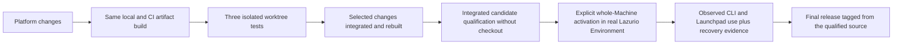

# Build and qualification lifecycle

How an installed Lazurio checks for, verifies and activates a product
version is the [product update contract](update.md) with decision
[F13](decisions.md#f13--release-trust-is-github-artifact-attestation). This document
binds what that contract does not repeat: the build and qualification lifecycle, the
two test modes and the install location. The earlier pilot installer, its TUF
metadata, signing keys, channels and repair procedures were removed together with
their code.

Status: the two test paths and deliberate whole-Machine candidate activation are
accepted outcomes, not a mandate to switch the current host.

Use one product version for CLI, server/Launchpad runtime and generator. Their
compatibility is tested as one delivered product. Profile/preferences schemas retain
their separate contract versions; they are not independently drifting binaries.

```text
reviewed PR + CI → main → tag vX.Y.Z-rc.N → release workflow builds and attests every target
                      → release candidate (prerelease, reached only by exact tag)
                      → qualify.yml: journeys J1–J6 on disposable runners
                      → canary: 8 hours on every hosted Machine of the pilot Organization
                      → tag vX.Y.Z at the candidate's source → final release (latest)
```

The release job refuses a final tag without the qualification and the canary of its
candidate: [Qualification and the canary](#qualification-and-the-canary).

A merge does not roll out software. Candidate acceptance includes install, product
upgrade, profile preservation and recovery on each supported native platform. A
release candidate is a GitHub prerelease: it is invisible to `latest` and reaches only
the Machines that ask for that exact tag. A final release requires an explicit
authorized decision — the protected tag and the required reviewer of the `release`
environment. Releases are immutable; a final version is a new tag built from the
qualified source, never a renamed candidate.

Artifact identity is immutable (`version + target + digest + source provenance`) and
is embedded in the executable and stated by the attested `manifest.json`. There is
no program rollback and no retained previous version (change of 2026-09-28 in the
[product update contract](update.md)); no path goes below the version floor.

Update behavior detects availability and explains compatibility; activation remains
explicit. Detection is not a download/execute mandate. Offline, a failed
verification, an unsupported target or unknown state preserves the current
installation and reports a precise reason.

Product update, profile activation and Source→Managed migration are distinct
operations. None of them returns to an earlier product version: a candidate proves
itself before the switch, and after it data and state are repaired forward, never by
starting an older binary on them ([migration and recovery](migration-and-recovery.md)).

Native distribution signatures stay separate from build provenance:
[Apple Developer ID and notarization](https://developer.apple.com/developer-id/)
are the macOS route to qualify, and a Windows public-trust signing provider requires
eligibility and identity validation. The Principal permits a controlled internal
pilot before them; public release still requires them and tests of the final signed
bytes. No OS protections are disabled.

## Build

Development packaging is executable with the pinned Bun from a clean committed
repository root:

```sh
bun run scripts/build-candidate.ts /absolute/absent/output-directory
bun run scripts/smoke-candidate.ts /absolute/absent/output-directory/lazurio
```

The parent output directory must already exist and be canonical; the output itself
must be absent. The build installs frozen development dependencies without lifecycle
scripts, runs the narrow publication guard, compiles the real CLI with its embedded
identity and emits `identity.json`. It refuses a dirty source or an existing output;
partial failed output is retained, not cleaned automatically. The identity describes
unattested bytes, not a release or a reproducibility proof.

The POSIX smoke accepts an existing executable, requires its embedded identity to
equal `identity.json`, creates its own temporary Folder, initializes Czech
instructions, changes to English, starts that executable's Launchpad, checks embedded
HTML, API denial and authenticated profile state, then stops it. The child's PATH
excludes development runtimes. This is not a clean-OS install, browser interaction,
full module journey or Windows acceptance. It never rebuilds the supplied candidate.

- Build the real `src/cli.ts` entrypoint, including its Launchpad assets and Folder
  Factory. `proof/main.ts` remains a separate demonstration and is not a release input.
  Pin Bun from `packageManager`; disable compiled ambient dotenv/bunfig loading.
  The distribution does not bundle every module's Bun or database dependency.
- One standalone executable per qualified native target. A release executable is
  built by `.github/workflows/release.yml` on a runner of its own target
  (`scripts/release-build.ts`) and is asked for its identity before it is uploaded.
  A local build must use an explicit new output directory and never replace an
  installation.
- No source checkout, user Bun/Node/npm, sudo, provider credential or access to a
  private integration repository is required merely to launch the installed CLI and
  Launchpad.

## Install location

Install per user outside the Folder: macOS `~/Library/Application Support/Lazurio`,
Linux `${XDG_DATA_HOME:-~/.local/share}/lazurio`. Resolve and validate actual absolute
paths; this notation is not shell code to execute. Versioned product directories are
immutable after verification. One stable entrypoint, `bin/lazurio`, selects the active
version; the layout under the base is the *State on disk* table of the
[product update contract](update.md). Windows (`%LOCALAPPDATA%/Lazurio`), its
entrypoint replacement and running-handle behavior must be designed and qualified
natively, not assumed from POSIX; it is not supported yet.

Qualification starts on the available native macOS ARM64 and Linux ARM64 fixtures.
Other target names in an identity schema do not establish support. Windows and the
remaining launch matrix remain required work, not silently dropped deliverables.
The full first installed consumer must use the real CLI/Launchpad module lifecycle,
not just `--help`.

## Two independent test modes


```mermaid
flowchart LR
  S[Platform changes] --> B[Same local and CI artifact build]
  B --> W[Three isolated worktree tests]
  W --> I[Selected changes integrated and rebuilt]
  I --> Q[Integrated candidate qualification without checkout]
  Q --> A[Explicit whole-Machine activation in real Lazurio Environment]
  A --> O[Observed CLI and Launchpad use plus recovery evidence]
  O --> P[Final release tagged from the qualified source]
```

**Worktree isolation:** three agents may run concurrently, each from its own Platform
worktree and exact artifact. Each gets an owned temporary Lazurio Folder and test Organization,
process-local PATH entry, server/allocated ports, state locator and evidence directory.
The test harness passes explicit paths; it must not fall back to the daily Lazurio Environment,
ambient credentials, normal user state or another test's server. Isolating a directory
alone is insufficient: redirect all product-owned OS state paths and inherit only
reviewed environment values. Fixtures contain no real Organization/Personalspace data.
Native acceptance uses a copied artifact with the checkout unavailable; rapid source
unit tests are allowed earlier. Cleanup verifies fixture/process ownership, preserves
private failure evidence and removes only that run's own resources.

**Integrated personal acceptance:** selected worktree changes are integrated at one
reviewed source ref and built through the same packaging path as CI. Run the combined
candidate tests before activation; no worktree build independently replaces daily
Lazurio. The Principal deliberately activates that exact candidate for the whole
single-Principal Machine: ordinary CLI launches and Launchpad use it with the selected
real Lazurio Environment and real Organizations. This is stronger than a temporary shell PATH override.
If the current Lazurio Folder needs migration, the migration rehearsal and separately authorized
apply must finish first. Design agreement here is not an instruction to act on a host.


Native qualification of the update mechanism itself — install with the systemd user
service, A → B, a B refused at start that ends `activation-unhealthy` while the
unit restarts without ever reaching `failed`, a candidate refused by its Launchpad
probe before the switch, a real reboot, no way back and the Launchpad pill's
click path — is `scripts/qualify-update-linux.ts`; it uses a loopback fixture
origin and a fixture Sigstore trust root that a release build never contains.

## Qualification and the canary

There is no program rollback ([recovery mode](recovery-mode.md), root decision 0166),
so a release is proven before it reaches any Machine. Three gates stand between a
candidate and a final release; each refuses on its own.

**1. Qualification.** When the Release workflow has published a prerelease
`vX.Y.Z-rc.N`, it starts `.github/workflows/qualify.yml` (`workflow_run`; a
maintainer can run it again by hand with the tag, `workflow_dispatch`). It is a
workflow of its own, not a job of `release.yml`: `release.yml` is the trust entry
point of every installed client and stays the publishing path only, a qualification
can be repeated without touching a release, and it needs no right beyond reading.
For every qualified target — `linux-x64` on `ubuntu-24.04`, `darwin-arm64` on
`macos-14` — each journey runs on a fresh runner of its own. The job checks out the
candidate's tag, downloads that tag's **published** assets (executable,
`manifest.json`, `lazurio.sigstore.json`, `install.sh`) and verifies them first
(`scripts/qualify/journeys.ts verify`: the digest in the manifest, `gh attestation
verify` of the release workflow at the tag, and the checkout is the manifest's
`source_commit`). The journeys go through the real GitHub Release and Sigstore path,
never a fixture origin:

| Journey | What it proves | Ubuntu (supervised) | macOS (unsupervised) | Proof |
| --- | --- | --- | --- | --- |
| J1 | First installation by the strict one command `curl --proto '=https' --tlsv1.2 -fsSL <install.sh of the tag> \| LAZURIO_VERSION=<tag> sh` (with `gh`'s independent check), `--version`, `self-check`, a Folder, the Launchpad, `lazurio recover` healthy | the same command with `--service systemd-user --folder`, the unit up on the candidate | Launchpad start, page, stop | executable |
| J2 | The previous final release, running on a Folder it rendered, updates to the candidate by `lazurio update --version <tag>` through GitHub and Sigstore with its own updater; the candidate's own `update` is up to date, only it is kept | restart and health at the candidate | restart required | executable |
| J3 | The candidate's Launchpad probe refuses before the switch (an interrupted Folder transaction): nothing switches; repaired, the same candidate goes forward | the candidate as the (offline) updater: `self-check-failed` / `launchpad-refused`, the Launchpad not restarted | the probe alone (no updater probes there) | executable |
| J4 | A Folder the candidate cannot read (R1): Recovery mode instead of an exit, `lazurio recover` exits 3 with the repair prompt and a prepared issue naming nothing of the Machine; the repaired Folder starts normally | the unit stays active, health `503`, no automatic restarts | `launchpad` prints `recovery-mode`, the page answers `503` | executable |
| J5 | A layout with rollback (`v0.1.6` updated offline to `v0.1.7`: `previous`, and with the service the rollback unit and `OnFailure=`) updated to the candidate by the last updater with rollback; the candidate's first command removes all of it | unit rewritten, rollback unit gone | `previous` gone | executable |
| J6 | A kill after every activation step converges forward (`tests/update-kill.test.ts`) | yes | yes | source |

J6 needs a hook inside the activation that no release executable has, so it runs the
candidate's own suite at the verified commit. A real reboot stays in the manual VM
qualification (`scripts/qualify-update-linux.sh`): a runner cannot reboot and
continue. J5 is deleted together with the migration it exercises
(`src/update/migrations/remove-rollback/README.md`). Not in the gate yet, though
proposed in [recovery mode G.2](recovery-mode.md#g2-proposed-gates): a Folder refresh
journey, the Launchpad under the unit with `kill -9` and a restart loop, hosted trust
behind a stand-in gateway, and an `ubuntu-24.04-arm` runner for `linux-arm64`.

**What a journey may touch.** Each job sets `HOME` to a runner-owned temporary
directory (`$RUNNER_TEMP/home`, `XDG_CONFIG_HOME`, `XDG_DATA_HOME`, `XDG_CACHE_HOME`
and `XDG_STATE_HOME` under it), and `journeys.ts` refuses the account's own home.
The install base, the Folder, `~/.local/bin`, the user units and the older releases
a journey downloads all live there. One system-level exception remains on Ubuntu,
deliberately: a supervised journey needs the account's real systemd user manager,
reading units from the isolated `XDG_CONFIG_HOME` and outliving each step. The job
writes a drop-in `Environment=XDG_CONFIG_HOME=…` for `user@<uid>.service` and runs
`sudo loginctl enable-linger`; a manager the runner already runs is reported in the
log and restarted with the drop-in. Linger was kept rather than avoided because
whether a hosted runner provides a user manager reachable through `XDG_RUNTIME_DIR`
could not be tested before the first run, and a manager without linger may stop
between steps. An always-run last step disables linger and removes the drop-in. The
manager's own runtime state stays under `/run/user/<uid>`.

Every journey writes one line of `lazurio.qualification.v1`
(`scripts/qualify/evidence.ts`): `tag`, `commit` (the candidate's source), `target`,
`runner`, `journey`, `proof` (`executable` or `source`), `outcome` (`ok` or `failed`),
`durationMs` and `sha256` of the executable that ran. The `evidence` job joins the
lines into the artifact `qualification-<tag>` (kept 90 days, also when a journey
failed) and fails unless every journey is `ok` exactly once on every target, for
exactly the bytes and the commit of the candidate's published manifest.

**2. Canary.** The qualified candidate is rolled by its exact tag to every hosted
Machine of the pilot Organization — its work VMs and the personal VMs of its
operators — through the path that pins each one's release (Machines' Plan, Permit
and apply; outside this repository). The 8 hours start when the last of them runs
the candidate; what is observed and what ends the stage early is
[recovery mode G.3](recovery-mode.md#g3-canary-stage-8-hours-on-every-machine-of-the-pilot-organization).
When the stage passed, the pilot Organization's release reviewer adds
`qualification/canary/<candidate>.json` by a pull request to this repository:

```json
{
  "schema": "lazurio.canary.v1",
  "candidate": "v1.4.0-rc.2",
  "start": "2026-10-01T08:00:00Z",
  "end": "2026-10-01T16:05:00Z",
  "machines": [
    { "machine": "3f9a0c1d2e4b5a69", "kind": "work", "active": "1.4.0-rc.2", "health": "healthy" },
    { "machine": "c41d9e0a7b3f5286", "kind": "personal", "active": "1.4.0-rc.2", "health": "healthy" }
  ],
  "reviewer": "<GitHub login>",
  "pullRequest": "https://github.com/Lazurio/LazurioPlatform/pull/<n>"
}
```

The record is public, so it carries ids only. A Machine is an opaque, stable id of
16–64 lowercase hex characters (for example the first 16 hex digits of a SHA-256
the reviewer derives from the Machine's private record); a hostname, an Organization
or a client name never appears, and there is no member for free text. `active` is
`lazurio update status --json` at the end of the stage, `health` is `healthy` when
`lazurio recover --json` answered healthy at the start and the end and no Recovery
mode happened in between (otherwise `recovery-mode` or `unhealthy`, which refuse).
`scripts/qualify/check-canary.ts` refuses a record that is missing, lasted less than
8 hours or has not ended, lists no Machine, no work VM or no personal VM, names a
Machine twice, has a Machine not on the candidate or not healthy, or has any value
outside its shape — and it never repeats a refused value in its answer. Times are
exactly `YYYY-MM-DDThh:mm:ssZ` and must print back as the same text, so an impossible
date such as `2026-02-30` or `24:00:00` is refused instead of being moved to another
day. Which
Machines are in scope is the reviewer's to state; the check cannot see the pilot
Organization's inventory.

**3. The final tag.** `vX.Y.Z` is tagged at the candidate's commit, or at a commit
that differs from it only under `qualification/` and `docs/evidence/` (the canary
record lands after the candidate). The job `qualified` of `release.yml` runs before
anything is built, drafted or put to the `release` reviewer, and refuses unless:
the tag carries a canary record `qualification/canary/vX.Y.Z-rc.N.json` (the highest
N wins) that passes `check-canary.ts --provenance`; the tag differs from that candidate's only in
those two directories; and a successful Qualify run of the default branch left the
artifact `qualification-vX.Y.Z-rc.N` whose evidence passes `evidence.ts check`
against the candidate's published manifest. A prerelease passes this job untouched;
it is qualified after it is published.

**Only a merged record counts.** `--provenance` asks GitHub about the record's
`pullRequest` and Git about the tag: the pull request is merged, into the default
branch, and added or changed the record; its merge commit is an ancestor of the final
tag's commit (the default branch is fetched when the tag's checkout lacks it); and the
record at the tag is byte-identical to the record at that merge commit. A tag on an
unmerged branch, or a record edited after its pull request, is refused. A later
correction of the record is a new pull request, and the record then names that one.

**The fast lane is the path, not the canary.** A fix goes through the same steps:
a new candidate, the journeys (in parallel, one runner each), the review,
and the same 8 hours on the same Machines. The canary is never shortened by a line in
a record or by the reviewer: a shorter canary for a named release exists only as the
Principal's recorded decision in the register, carried out by a reviewed change of
`check-canary.ts` that names it. Meanwhile the Machine that is broken is covered by
its Recovery mode.

## Required lifecycle evidence

For the current foundation proof, `bun run scripts/identify-proof.ts` rebuilds
the native proof from a clean committed checkout and emits its byte digest,
size, source commit, lockfile digest and pinned toolchain. This is an unsigned
build identity, not publisher authentication, a release manifest or a native
installation qualification. Run from the repository root using the pinned Bun.
The output must not be used as authorization to install or activate a product.

Run three simultaneous fixtures and prove distinct PATH resolution, Lazurio Folder, state and
processes; deliberately collide a port and terminate one run without harming its peers
or daily installation. Separately prove integrated Machine activation with cold CLI
and Launchpad starts, a busy writer, old session, build failure, interrupted switch,
health failure, incompatible downgrade and new data writes. Record exact native OS,
artifact and harness versions. Personal acceptance is not a substitute for the other
OS cells. Failure logs stay private until separately sanitized for public evidence.
